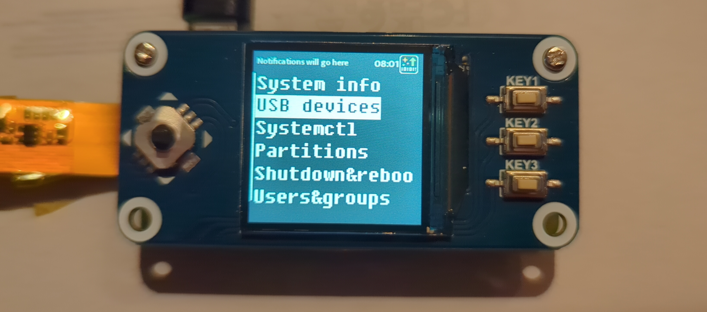
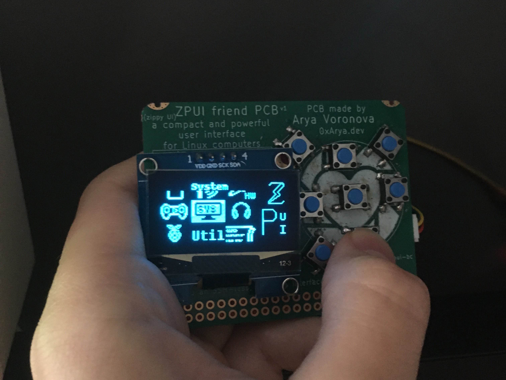
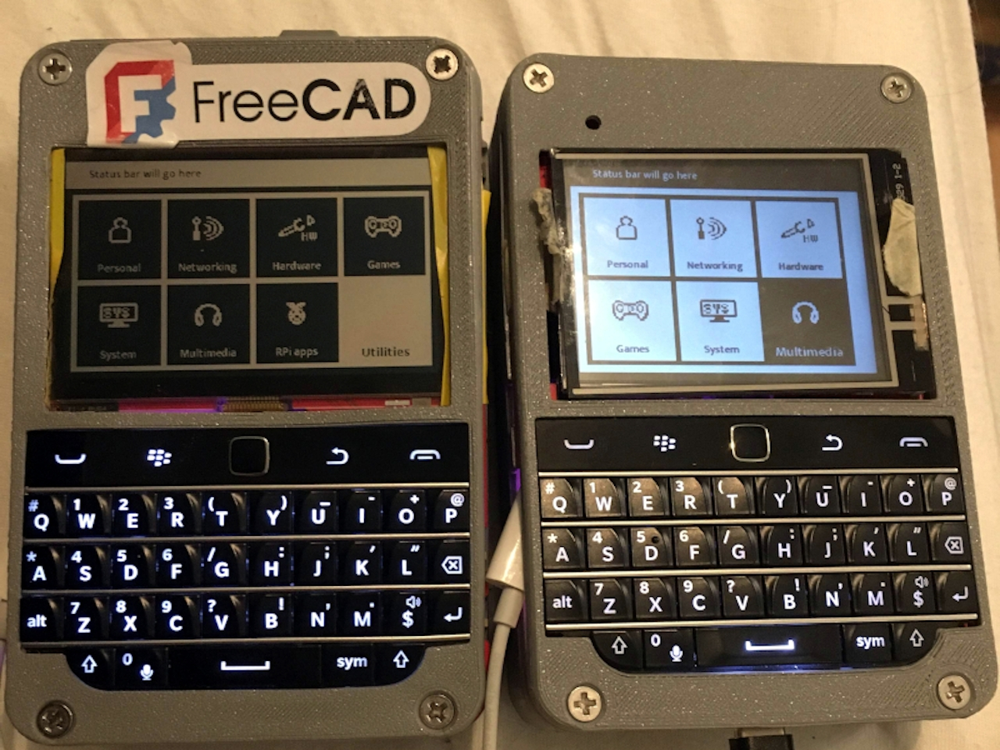
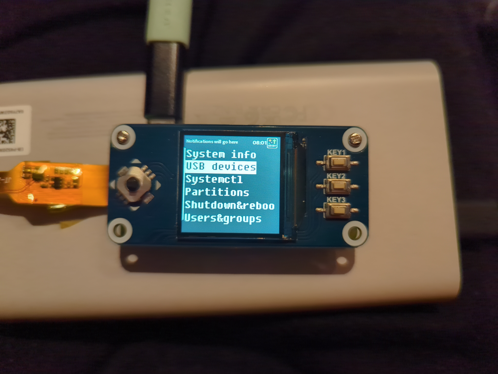

Welcome to ZPUI documentation!
=================================

ZPUI (ZeroPhone UI, pronounced *zippy ui*) is a powerful user interface and app framework for small screens.
It's usable on a wide variety of single-board computers, and originally designed for the ZeroPhone project.
ZPUI only requires a small screen, monochrome or color, starting from 128x64 OLED screens, and some buttons - starting from 5 buttons and up to an entire QWERTY keyboard.

Capabilities
------------

What does ZPUI give you?

* Small physical interface for your small Linux computer management, at your fingertips
* Safe shutdowns, unmounts, service restarts, password resets, and more
* Connecting to WiFi, including password input with 5 buttons; setting WiFi country
* Seeing your board's IP address, debugging network issues, connecting to Tailscale, enabling/disabling SSH, network debugging and scanning
* Ability to quickly write your own ZPUI apps in Python, with tutorials and documentation, with a ZPUI emulator for development use
* Running arbitrary scripts and general debugging
* Basic control over media (volume and media player control)
* Hardware tinkering and debugging apps
* An updater and notifier to receive the latest ZPUI features as soon as they're out

...and much more.

ZPUI is great for:

* Controlling a server Raspberry Pi on a shelf - especially when it malfunctions
* An in-place control panel for a task-tailored Pi, from a 3D printer controllers and CCTV cameras, to routers and PiHole installations
* A base for building your own custom devices with a simple yet powerful UI
* Figuring out how to log into a random SBC you use for tinkering
* A rescue interface for full-sized PC configured as a NAS, or even
* A primary interface for a pocket computer you carry around as a Linux terminal.

Hardware
--------

Currently stock-supported devices and screen&button shields:

* Beepy, Colorberry, Blepis handhelds
* ZPUI businesscard (both Pi GPIO and QWIIC)
* WaveShare 1.3" 240x240 LCD HAT
* WaveShare 1.3" 128x64 OLED HAT (untested but should work)
* OG ZeroPhone

Other device support can be added relatively trivially, too.

ZPUI businesscard with a 128x64 OLED, useful for on-the-fly debugging - only requires a spare QWIIC connector.

ZPUI on two Blepis PDAs, one with a Sharp Memory 400x240 LCD, and another with a 320x240 color LCD with backlight

ZPUI on the WaveShare 1.3" 240x240 LCD HAT

Other device support is easy enough - most of the time, you'll only need to edit a config file.

Minimum requirements:

    * monochrome/color screen, 128x64 or larger. For instance, one of:

        * 128x64 OLED (common)
        * 320x240 color LCD screen
        * 400x240 Sharp monochrome or JDI color screen

    * 5 buttons (up/down/left/right/enter), with support for QWERTY keyboards. For instance, one (or multiple) of:

        * Pi GPIO buttons
        * Pi GPIO matrix button
        * I2C/SPI GPIO expander-connected buttons
        * HID device (USB, I2C, emulated etc.)

ZPUI is based on pyLCI, a general-purpose UI for embedded devices, an interface that supports 16x2 and larger character displays.
Currently. ZPUI is tailored for Blepis and ZPUI businesscard hardware, but expanding into other form-factors and usecases,
and the documentation is being improved along with the effort.

Credits:
--------

ZPUI development is funded through `the NGI0 Core Fund <https://nlnet.nl/core/>`_,
a fund established by `NLnet <https://nlnet.nl/>`_ with financial support
from the European Commission's `Next Generation Internet programme <https://ngi.eu/>`_,
under the aegis of `DG Communications Networks, Content and Technology <https://commission.europa.eu/about/departments-and-executive-agencies/communications-networks-content-and-technology_en>`_
under grant agreement No `101092990 <https://cordis.europa.eu/project/id/101092990>`_.

Guides:
-------

* :doc:`Installing and updating ZPUI <setup>`
* :ref:`Installing ZPUI emulator <emulator>`
* :doc:`Developing a simple app <tutorial_1>`
* :doc:`Developing a Canvas-using app <tutorial_2>`
* :doc:`App development how-tos <howto>`
* :doc:`ZPUI configuration files <config>`
* :doc:`Hacking on UI <hacking_ui>`
* :doc:`Logging configuration <logging>`

References:
===========

- :doc:`Crash course <crash_course>`
- :doc:`UI elements <ui>`
- :doc:`Helper functions <helpers>`
- :doc:`Input system <input>`

  - :doc:`Keymaps <keymap>`

- :doc:`Output system <output>`

:doc:`Usability guidelines <ux>`

:doc:`Contact us <contact>`

:doc:`Working on documentation <docs_development>`

.. toctree::
   :maxdepth: 1
   :hidden:

   index.rst
   setup.rst
   config.rst
   tutorial_2.rst
   tutorial_1.rst
   crash_course.rst
   howto.rst
   ui.rst
   helpers.rst
   input.rst
   output.rst
   keymap.rst
   hacking_ui.rst
   logging.rst
   ux.rst
   apps.rst
   app_mgmt.rst
   docs_development.rst
   contact.rst
