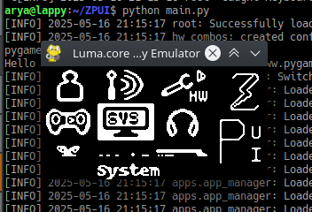

.. _setup:

Installing and updating ZPUI
############################

Installing ZPUI on real hardware (Raspberry Pi and other SBCs)
==============================

If you want to use ZPUI on your Linux PC without an external screen&buttons, scroll to :ref:`the emulator section <emulator>`.

ZPUI is installed by default on official Blepis and ZeroPhone SD card images. However, if 
for some reason you don't have it installed on your SD card, or if you'd like to 
install ZPUI on some other OS, you have to log in (using SSH or keyboard/mouse) and do this:

Installation
------------

.. code-block:: bash

    git clone https://github.com/ZeroPhone/ZPUI
    cd ZPUI/
    # Install main dependencies (apt and pip packages), configure systemd, and create a system-wide ZPUI copy
    sudo ./setup.sh
    # Run this script to help you configure the IO for ZPUI to use
    sudo ./config.py
    # Start the system to test your configuration - do screen and buttons work OK?
    sudo python main.py 
    # Once tested:
    sudo ./sync.sh # Transfer the working system to your system-wide ZPUI copy

.. _local_system_copy:
.. admonition:: Behind the scenes
   :class: note

   There are two ZPUI copies on your system - your local copy, which you downloaded ZPUI into, 
   and a system-wide copy, which is where ZPUI is launched from when it's started
   as a service (typically, ``/opt/zpui``).
   When you run ``./setup.sh``, the system-wide (``/opt/zpui``) ZPUI copy is created,
   and a ``systemd`` unit file registered to run ZPUI from ``/opt/zpui`` at boot. 
   The system-wide copy can then be updated from the local copy using the ``./sync.sh`` script.
   If you plan on modifying your ZPUI install, it's suggested you stick to a workflow like this:

   * Make your changes in the local copy
   * Stop the ZPUI service (to prevent it from grabbing the input&output devices), using ``sudo systemctl stop zpui.service``.
   * Test your changes in the local directory, using ``sudo python main.py``
   * If your changes work, transfer them to the system-wide directory using ``sudo ./sync.sh``

   Such a workflow is suggested to allow experimentation while making it harder 
   to lock you out of the system, given that ZPUI has to work at all times.
   If ZPUI is inaccessible, that might prevent you from knowing your device's IP address, 
   connecting it to a wireless network, or turning on SSH.
   In documentation, ``/opt/zpui`` will be referred to as **system-wide copy**, 
   while the directory you cloned the repository into will be referred to 
   as **local copy**.

Updating
--------

To get new ZPUI changes from GitHub, you can run **"Settings"** -> **"Update ZPUI"** 
from the main ZPUI menu, which will update the system-wide copy by doing things like
``git pull``, ``pip install -r requirements.txt`` and running tests (it's also way
fancier than just running commands, of course).

If you want to sync your local copy to the system-wide copy, you can run ``sync.sh``.
You can also run ``update.sh`` to sync and simultaneously update your ZPUI to the latest version from Github.

Controlling the system-wide ZPUI copy
-------------------------------------

To control the system-wide ZPUI copy, you can use the following commands:

* ``sudo systemctl start zpui.service``
* ``sudo systemctl stop zpui.service``
* ``sudo systemctl status zpui.service``

Launching the system manually
-----------------------------

For testing configuration or development, you will want to launch the local copy of ZPUI directly 
so that you can see the ZPUI logs in real time, and be able to stop it with a simple Ctrl^C. 
In that case, just run ZPUI with ``sudo python main.py`` from your local (or system-wide) directory. 
If ZPUI is already running system-wide, run ``sudo systemctl stop zpui`` to stop it.

-----------

.. _emulator:

Installing the ZPUI emulator
============================

If you want to develop ZPUI apps without having to use hardware like external screen&buttons, 
there's an option to use the emulator with a Linux PC - the emulator can use your 
screen and keyboard instead of ZeroPhone hardware. The emulator works very well for 
app development, and just as well for UI element and ZPUI core feature development.

System requirements
-------------------

* Some kind of Linux - there are install instructions for Ubuntu, Debian and OpenSUSE, but it will likely work with other systems, too
* Graphical environment (the emulator is based on Pygame)
* A keyboard (the same keyboard that you're using for the system will work great)

.. admonition:: Behind the scenes
   :class: note

   There's only ever a single copy of ZPUI when using the emulator. So, things like "system-wide copy" and "local copy"
   from the first section don't apply here. This means you won't be using ``setup.sh``, ``update.sh`` or ``sync.sh`` - don't run them.
   The "Update ZPUI" feature in Settings app will still work wonders!

Emulator settings
-----------------

By default, the emulator uses screen mode '1' (monochrome) and 128x64 resolution.
You can pass resolution and mode settings to the emulator by editing ``config.yaml``:

.. code-block:: yaml

    device: emulator
    resolution: 400x240
    mode: RGBA

Ubuntu/Debian installation
--------------------------

Assuming Python 3 is the default Python version:

.. code-block:: bash

    sudo apt-get update
    sudo apt-get install python-pip git python-dev build-essential python-pygame
    git clone https://github.com/ZeroPhone/ZPUI
    cd ZPUI
    # Run the config script and pick "emulator" IO option
    sudo ./config.py
    #Run the emulator
    python main.py

Arch Linux installation
-----------------------
.. code-block:: bash

    sudo pacman -Si python-pip git python-pygame
    git clone https://github.com/ZeroPhone/ZPUI
    cd ZPUI
    # Run the config script and pick "emulator" IO option
    sudo ./config.py
    #Run the emulator
    python main.py

OpenSUSE installation
---------------------

.. code-block:: bash

    sudo zypper install python-pip git python-devel gcc python-curses python-pygame

    git clone https://github.com/ZeroPhone/ZPUI
    cd ZPUI
    # Run the config script and pick "emulator" IO option
    sudo ./config.py
    #Run the emulator
    python main.py

Emulator credits
----------------

Most of the emulator research and work was done by Doug, and later 
refactored by Brian Dunlay. The emulator input driver was done by Arya.
OpenSUSE instructions were compiled with help of `piajesse`_.
Arch Linux instructions were compiled by `monsieurh`_.

.. _monsieurh: https://github.com/monsieurh
.. _piajesse: https://hackaday.io/piajesse
