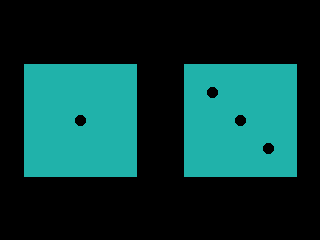
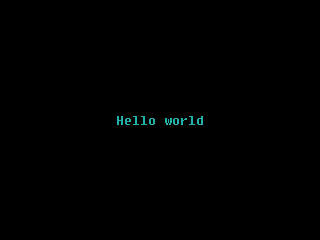
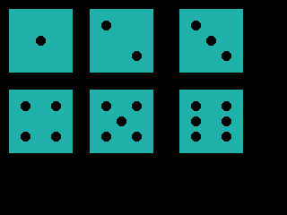

.. _tutorial_1:

App writing tutorial 1: Dice Roll
#################################

Do you want to improve your ZPUI app or solve your problem by copy-pasting
a snippet in your app code? This page is for you =)

.. contents::
    :local:
    :depth: 1

Here's how you develop a simple ZPUI application - a pair of virtual dice.
You want to use a Linux PC of some sort; WSL could work, I imagine.
If you're developing for the Beepy/Blepis, you can develop and test directly on them through SSH.
If developing on a Linux PC, :ref:`install the emulator <emulator>`.

We'll be developing this app for a Blepis/Beepy screen, at least initially.
For this, you'll want to add a ``resolution: 320x240`` (or ``400x240``) line
into your ZPUI emulator ``config.yaml`` file, and test run ZPUI to see that the default resolution has indeed been changed.

Setup
=====

In the console, do this:

.. code-block:: bash

    git clone https://github.com/ZeroPhone/zpui-example-app/
    cd zpui-example-app
    python3 rename.py zpui_diceroll

This downloads a ZPUI app template and renames it. From here, you can edit the app metadata, adding your name and maybe email instead of mine, and install it:

.. code-block:: bash

    nano pyproject.toml
    python -m pip install --break-system-packages --editable .

.. note:: Remove the ``--break-system-packages`` part if it fails - this way of install makes development significantly easier, and works around a safeguard that 
          doesn't apply because ZPUI apps don't ship dependencies, but it might not be present in your OS

Now, you can launch (or restart) ZPUI to have your newly installed app load. You won't need to re-run the setup command,
as code changes will be picked up on each ZPUI startup.
Also, the app will have example code - we won't need to reuse much of it, but it's a decent reference for your own forays.

Editing the code
================

The app code is found in ``src/zpui_diceroll/app.py``. Here's two things you'll want to change first:

- ``menu_name`` - we'll put "Dice roll" in there
- ``module_path`` - a directory to put the app in. Our app will fit best in the "Utilities" main menu directory - `check here`_,
  and you can see that the right path is ``"utils/"``.

.. _check here: https://github.com/ZeroPhone/ZPUI/tree/master/apps

Now, feel free to cut out ``test(self)`` and ``get_text(self)`` function blocks, as well as the entirety of the ``on_start(self)`` block contents.
We don't need to initialize any resources, which means ``init_app()`` can remain empty, or you can even delete it.
The only place we need to put our code is inside the now emptied ``on_start()``. 

Dice have to be drawn on the screen. The easiest way to draw things is by using the ``Canvas`` we have in ``zpui_lib``.
At the top, add ``Canvas`` to the end of the ``from zpui_lib.ui import`` line - and add a ``from time import sleep`` line there while at it.

.. code-block:: python

    from zpui_lib.ui import Canvas # old Printer and Menu imports got removed
    from time import sleep

Then, in ``on_start()``, put this:

.. code-block:: python

    def on_start(self):
        c = Canvas(self.o) # self.o is an output object for UI elements to use
        c.centered_text("Hello world", font=("Fixedsys62.ttf", 16))
        c.display() # necessary for Canvas to draw onto screen
        sleep(3)

Wonderful! Save the file, then launch (or restart) ZPUI, find the "Dice roll" app in the "Utilities" directory, and click it.
It will show up a "Hello world" on the screen, and then exit after 3 seconds (or earlier if you press the left button).

Let's draw a rectangle on the canvas instead. Remove the ``centered_text`` line, and replace it with ``c.rectangle_wh((20, 20, 30, 30), fill=c.default_color)``. That's a good start, giving us a 30x30 filled rectangle in the top left corner, with its top left corner at ``(20, 20)`` point.

Let's put dice drawing code into a function instead.

.. code-block:: python

    def draw_dice(self, c, size=70, start_x=10, start_y=10, value=1, r=5):
        c.rectangle_wh((start_x, start_y, size, size), fill=c.default_color)

    ...
    # then, in on_start():
        self.draw_dice(c, value=2)
        c.display()

That will give us a similar result (70x70 rectangle in the top left corner at ``(10, 10)`` ),
but this way, we can easily change the size and the position of the dice - which helps if we want to draw two dice being rolled, and we do.

*(this is not a 70x70 rectangle, but I hope you can forgive me for not having the best screenshot)*

Now, in ``draw_dice``, after the ``rectangle_wh`` call, let's add code to draw the dice circles for values from 1 to 6:

.. code-block:: python

    c_x = int(start_x + size//2); c_y = int(start_y + size//2)
    color = c.background_color
    x1 = c_x - (c_x-start_x)//2; y1 = c_y - (c_y-start_y)//2 # top left circle coordinates
    x2 = c_x + (c_x-start_x)//2; y2 = c_y + (c_y-start_y)//2 # bottom right circle coordinates
    if value in (1, 3, 5): # the center circle
        c.circle((c_x, c_y, r), outline=color, fill=color)
    if value in (2, 3, 4, 5, 6):
        # draw top left and bottom right circles, like this: `-,
        c.circle((x1, y1, r), outline=color, fill=color)
        c.circle((x2, y2, r), outline=color, fill=color)
    if value in (4, 5, 6):
        # now, draw bottom left and top right circles, too
        c.circle((x1, y2, r), outline=color, fill=color)
        c.circle((x2, y1, r), outline=color, fill=color)
    if value == 6:
        # only 6 needs the center-left and center-right circles
        c.circle((x1, c_y, r), outline=color, fill=color)
        c.circle((x2, c_y, r), outline=color, fill=color)

In ``on_start()``, you could write a loop that neatly positions the dice on the screen, but for testing, it's sufficient to do this:

.. code-block:: python

    self.draw_dice(c, start_x=10, start_y=10, value=1)
    self.draw_dice(c, start_x=100, start_y=10, value=2)
    self.draw_dice(c, start_x=200, start_y=10, value=3)
    self.draw_dice(c, start_x=10, start_y=100, value=4)
    self.draw_dice(c, start_x=100, start_y=100, value=5)
    self.draw_dice(c, start_x=200, start_y=100, value=6)

These yield us a pretty picture:

Input processing
==============

So far, we've only done output, but you'd highly benefit from knowing a simple way to handle input, too. Get ``ExitHelper`` from ``zpui_lib.helpers``:

.. code-block:: python

    from zpui_lib.helpers import setup_logger, local_path_gen, ExitHelper # adding to line 1 of app.py

In ``on_start()``, you'll want to create an ``ExitHelper``, and add an idle loop using it in the end of your ``on_start()`` code:

.. code-block:: python

    [... our dice drawing code ...]
    # remove the sleep(3)
    eh = ExitHelper(self.i).start()
    while eh.do_run():
        sleep(0.1)

``ExitHelper``'s main feature is letting your code run (or, more commonly, idle) up until you press ``"Left"``.
You can even do some rudimentary key processing with it, as you can 
`see in the Flashlight app code`_.

.. _see in the Flashlight app code: https://github.com/ZeroPhone/ZPUI/blob/master/apps/flashlight/main.py#L91

.. note:: Apps can already "exit" on ``Left`` press by default, up until you map the ``Left`` key to something else, but that's a failsafe -
          it simply de-focuses the app instead of stopping your code that's running in it,
          and it's intended to prevent app hangs and crashes from making ZPUI become unusable.

With this addition, the dice will be shown on the screen up until you press ``Left``, not just for 3 seconds at a time like before.
This is more than good enough for simple apps.

.. code-block:: python

    def on_start(self):
        eh = ExitHelper(self.i).start()
        c = Canvas(self.o) # self.o is an output object for UI elements to use
        self.draw_dice(c, start_x=10, start_y=10, value=1)
        self.draw_dice(c, start_x=100, start_y=10, value=2)
        self.draw_dice(c, start_x=200, start_y=10, value=3)
        self.draw_dice(c, start_x=10, start_y=100, value=4)
        self.draw_dice(c, start_x=100, start_y=100, value=5)
        self.draw_dice(c, start_x=200, start_y=100, value=6)
        c.display()
        while eh.do_run():
            sleep(0.1)

Finalizing the app
==================

Let's round this up with actually generating a pair of randomly rolled dice, every time you open the app.
At the top of the app file, add ``from random import choice``.
Then, let's split the screen in half, and draw two dice - one on the left, and one on the right,
scaling the dice to the size of the screen available.

.. code-block:: python

    def on_start(self):
        c = Canvas(self.o)
        # let's calculate dice coordinates here
        cx, cy = c.get_center() # cx is centerpoint x, which means it's == width of half of the screen
        # so, let's pick the smallest fitting side for our screen,
        # and shrink it so that there's comfortable borders on the sides.
        # For a 320x240 screen, that'll be 112, which fits well enough
        dice_size = int(min(self.o.height, cx)*0.7)
        y = (self.o.height-dice_size)//2
        x1 = (cx-dice_size)//2; x2 = x1 + cx
        # we have the coordinates!
        d1 = choice(range(1, 7))
        d2 = choice(range(1, 7))
        self.draw_dice(c, start_x=x1, start_y=y, value=d1)
        self.draw_dice(c, start_x=x2, start_y=y, value=d2)
        c.display()
        eh = ExitHelper(self.i).start()
        while eh.do_run():
            sleep(0.1)

ZPUI isn't big on animations, but for the sake of a tutorial, we can try and add one!
The simplest animation possible is to scroll through dice values for a second before showing the final one,
which we can easily achieve by rewriting our code like this:

.. code-block:: python

    [...]
    # we have the coordinates!
    for i in range(11):
            d1 = choice(range(1, 7))
            d2 = choice(range(1, 7))
            self.draw_dice(c, size=dice_size, start_x=x1, start_y=y, value=d1)
            self.draw_dice(c, size=dice_size, start_x=x2, start_y=y, value=d2)
            c.display()
            sleep(0.02)
        [... code continues with ExitHelper ...]

.. note:: This animation's framerate (and the resulting delay) will depend on CPU performance, since on lower-power devices, canvas operations can be surprisingly 
          heavy (especially once text rendering is involved). This will likely mean it will be fast on emulator, but it could get slow on Pi Zero-powered devices.
          If you run into this issue and want to negate it, instead of drawing rectangles and circles anew every time, you can pre-generate & cache dice roll
          images and then paste them onto the canvas, like the ZPUI main menu does for Beepy/Blepis resolutions.

As an aside - with very few changes (dynamically calculating instead of hardcoding circle radius), the app works on 128x64 screens, too!

You can find the resulting app code `here`_,
but you might've noticed you don't need to install it - the app is now available in ZPUI stock.
By the time you visit its code in the ZPUI repo, you could very well find it to have gained features!

.. _here: https://github.com/ZeroPhone/zpui_diceroll

Hope this tutorial has been useful, and, let me know if anything has been unclear.

.. note:: Currently, ZPUI's UI output capabilities don't compare well to i.e. those of LVGL, and neither does it provide a markup language. It does currently 
          provide enough graphics primitives to design a variety of basic UIs, and work on more complex UI constructs is being done as more applications are developed. 
          Feedback and contributions are welcome!

