.. _tutorial_1:

App writing tutorial 1: List of Lists
#####################################

.. contents::
    :local:
    :depth: 1

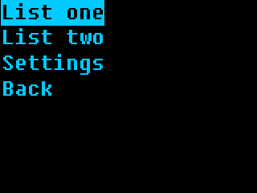

As a simple start, let's develop a lists app! You can put any lists in there -
foods you like, things in your fridge, 

As last time, you want to use a Linux PC of some sort; WSL could work, I imagine.
If you're developing for the Beepy/Blepis, you can develop and test directly on-device through SSH,
maybe even editing the files on your computer with help of SSHFS.
If developing on a Linux PC, :ref:`install the emulator <emulator>`.

This app will work on any ZPUI-supported screen, whether it's Blepis/Beepy with their 320x240
and 400x240 screens, or a 128x64, because we'll be using standard UI elements all throughout.

Setup
=====

In a console, do this:

.. code-block:: bash

    git clone https://github.com/ZeroPhone/zpui-example-app/ zpui-listolists
    cd zpui-example-app
    python3 rename.py zpui_listolists

This downloads a ZPUI app template and renames it. From here, you can edit the app metadata, adding your name and maybe email instead of mine, and install it:

.. code-block:: bash

    nano pyproject.toml
    python install.py

Now, you can launch (or restart) ZPUI to have your newly installed app load. You won't need to re-run the setup command,
as code changes will be picked up on each ZPUI startup.
Also, the app will have example code - we won't need to reuse much of it, but it's a decent reference for your own forays.

`Click here <https://github.com/ZeroPhone/zpui-listolists/blob/38dfa0baf758d1a24bbbe0ace2fe6c7168760e6d/src/zpui_listolists/app.py>`_ to see how the app code looks at this point.

Editing the code
================

The app code is found in ``src/zpui_listolists/app.py``.
Here's two things you'll want to change first:

- ``menu_name`` - we'll put "List o' lists" in there for now, but we'll make the app rename-able, too!
- ``module_path`` - a directory to put the app in. Our app will fit best in the "Personal" main menu directory, so we won't change the default.
  `Check here`_ to see which categories are available by default!

.. _check here: https://github.com/ZeroPhone/ZPUI/tree/master/apps

Now, feel free to cut out ``test(self)`` and ``get_text(self)`` function blocks.
We'll want a config file for our app - just add a `"work with config file" snippet <howto_config_file_class>`
into ``init_app``. It will look something like this:

.. code-block:: python

    default_config = """app_name: List o' lists
    lists:
      - name: List one
        entries:
         - First entry
         - Second entry
         - Third entry
      - name: List two
        entries:
         - First entry 2
         - Second entry 2
         - Third entry 2
    """
    
    class App(ZeroApp):
        menu_name = "List o' lists" # App name as seen in main menu while using the system
        config_filename = "config.yaml"
    
        def init_app(self):
            # this is where you put commands that need to run when ZPUI loads
            # if you want to do something long-winded here, consider using BackgroundRunner!
            # feel free to completely remove this function if it's not used
            self.config = read_or_create_config(local_path(self.config_filename), default_config, self.menu_name+" app")
            logger.info(f"Our config looks like this: {self.config}")
            self.save_config = save_config_method_gen(self, local_path(self.config_filename))
            self.menu_name = self.config.get("app_name", self.menu_name) # now the app can be renamed from the config file

Now, we have a config file that stores the lists for us, with a few example lists already inside, as well as the app's menu name.
If we modify the contents of that config file, we can also call ``self.save_config()`` to save the changes.

In ``on_start``, we have a ``Menu`` - and a ``Menu`` is perfect for a list of entries
for a user to click through!
Let's change the menu contents generation code to process list entries instead,
using ``lambda`` statements to create menu callbacks on the fly for each list entry we'll have,
and add a "Settings" entry at the bottom.

.. note:: There's a `Python peculiarity <howto_gotcha_lambda>` with generating lists
          in a loop like this, where all of our ``lambda``s will end up using the very last ``list``
          - unless we use intermediate variables. So, ``x`` is our intermediate variable!
          If you want to see how this fails, feel free to replace ``lambda x=list: self.list_menu(x)``
          with the seemingly more straightforward ``lambda: self.list_menu(list)``,
          and then click on the first list - it will have entries from the second list.

.. code-block:: python

    def settings_menu(self):
        # example 
        Printer("Settings", self.i, self.o, 2)

    def list_menu(self, list):
        Printer(f"List {list}", self.i, self.o, 2)

    def on_start(self):
        """This function is called when you click on the app in the main menu"""
        mc = []
        for list in self.config["lists"]:
            mc.append([list.get("name", "List name missing!"), lambda x=list: self.list_menu(x)])
        mc.append(["Settings", self.settings_menu])
        m = Menu(mc, self.i, self.o, name=self.menu_name+" main menu")
        logger.info("menu is starting yay")
        m.activate()
        logger.info("menu has exited yay")

Wonderful! Save the file, then launch (or restart) ZPUI, find the "List o' lists" app in the "Personal" menu, and click it.
It will give you a menu, with our two config-defined lists, a "Settings" entry, and an "Exit" entry.
Click on the list entries or the Settings, play around, see how the app works so far.

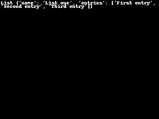
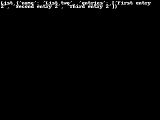

`Click here <https://github.com/ZeroPhone/zpui-listolists/blob/363dd33f75a8702c47736eac6be698af64b35760/src/zpui_listolists/app.py>`_ to see how the app code looks at this point.

User input
==========

Of course, a list of lists is no good if you can't edit it in-app. For a small target, let's figure out list name changes.

At the top, add an import for ``UniversalInput`` from ``zpui_lib.ui``:

.. code-block:: python

    from zpui_lib.ui import PrettyPrinter as Printer, Menu, UniversalInput

Now, we create a ``Menu`` for settings, and add an "Edit names" entry into it - largely copy-pasting
the ``Menu`` code from ``on_start``:

.. code-block:: python

    def settings_menu(self):
        mc = [["Edit names", self.edit_names]]
        Menu(mc, self.i, self.o, name=self.menu_name+" settings menu").activate()

An "Edit names" function could look like this:

.. code-block:: python

    def edit_names(self):
        mc = []
        for index, list in enumerate(self.config["lists"]):
            mc.append([list.get("name", "List name missing!"), lambda x=index: self.edit_name(x)])
        Menu(mc, self.i, self.o, name=self.menu_name+" name edit menu").activate()

``enumerate()`` here is very useful to get index of the list inside ``config["lists"]``, since the index
is the most reliable way to identify a list inside the config file.

Now, for the actual name editing?
The `Howto <howto>` page has `just the snippet <howto_input_text>` for you!

.. code-block:: python

    def edit_name(self, index):
        current_name = self.config["lists"][index].get("name", "")
        name = UniversalInput(self.i, self.o, value=current_name, message="List name:", name=f"List {index} ({current_name}) name input").activate()
        if name:
            self.config["lists"][index]["name"] = name
            self.save_config()

Now, run the app again, and you'll be able to edit list names when you go into Settings!

.. image:: _static/tut2_5.png
.. image:: _static/tut2_6.png
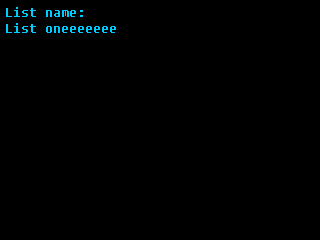

Whoops, a bug - the name only changes after we re-enter the app:

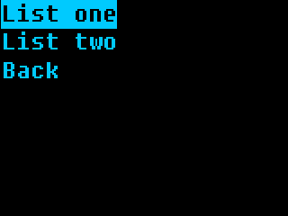
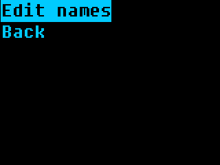
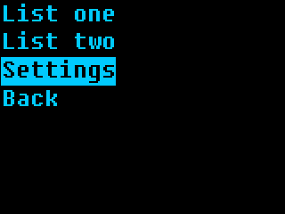
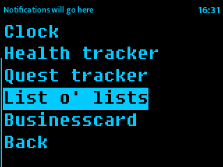
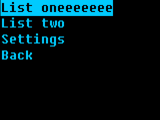

`Click here <https://github.com/ZeroPhone/zpui-listolists/blob/a47d20e3cb1ba4ffdd7de175abb9f361cbf94b3b/src/zpui_listolists/app.py>`_ to see how the app code looks at this point.

Keep your menu updated
======================

On the screenshots, you can see that immediately after changing a list name and then being returned into the "Edit name" menu, that menu still has the old name. The main menu similarly doesn't auto-update the name, either.
Why? Because the way we wrote this code, menu contents are generated only every time it's created in the ``edit_names`` function.

We can do it in a better way! Here's how the name edit menu looks now:

.. code-block:: python

    def edit_names(self):
        mc = []
        for index, list in enumerate(self.config["lists"]):
            mc.append([list.get("name", "List name missing!"), lambda x=index: self.edit_name(x)])
        Menu(mc, self.i, self.o, name=self.menu_name+" name edit menu").activate()

And here's how you need to change it:

.. code-block:: python

    def edit_names(self):
        def get_contents():
            mc = []
            for index, list in enumerate(self.config["lists"]):
                mc.append([list.get("name", "List name missing!"), lambda x=index: self.edit_name(x)])
            return mc
        Menu([], self.i, self.o, contents_hook=get_contents, name=self.menu_name+" name edit menu").activate()

This is a small change, but it makes your app all that more user-friendly! We can also update the main menu in this way:

.. code-block:: python

    def on_start(self):
        """This function is called when you click on the app in the main menu"""
        def get_contents():
            mc = []
            for list in self.config["lists"]:
                mc.append([list.get("name", "List name missing!"), lambda x=list: self.list_menu(x)])
            mc.append(["Settings", self.settings_menu])
            return mc
        m = Menu([], self.i, self.o, contents_hook=get_contents, name=self.menu_name+" main menu")
        logger.info("menu is starting yay")
        m.activate()
        logger.info("menu has exited yay")

.. image:: _static/tut2_5.png
.. image:: _static/tut2_6.png

.. image:: _static/tut2_8.png

`Click here <https://github.com/ZeroPhone/zpui-listolists/blob/84821c18f0c30627a349bdfee6867ef7f5f8dbcd/src/zpui_listolists/app.py>`_ to see how the app code looks at this point.

Adding, editing, removing
=========================

Now we know how to do basically every single thing we could need for the app!
Let's continue by actually showing list entries inside list menu. For that,
it would be better to change the ``on_start`` menu generation code to pass
the index instead of the list:

.. code-block:: python

    # inside on_start:

    for index, list in enumerate(self.config["lists"]):
        mc.append([list.get("name", "List name missing!"), lambda x=index: self.list_menu(x)])

From here, let's make a basic ``list_menu()`` function, with a few stubbed features:

.. code-block:: python

    def add_entry(self, list_index):
        pass # TODO

    def edit_entry(self, list_index, entry_index):
        pass # TODO

    def list_menu(self, list_index):
        def get_contents():
            mc = []
            list = self.config["lists"][list_index]
            for entry_index, entry in enumerate(list.get("entries", [])):
                mc.append([entry, lambda x=entry_index: self.edit_entry(list_index, x)])
            mc.append(["Add entry", lambda: self.add_entry(list_index)])
            return mc
        Menu([], self.i, self.o, contents_hook=get_contents, name=self.menu_name+" main menu").activate()

.. image:: _static/tut2_14.png

How hard could it really be to add and edit entries?
Just copy-paste already existing code from ``edit_name`` and edit the code a little!

.. code-block:: python

    def add_entry(self, list_index):
        entry = UniversalInput(self.i, self.o, message="Entry name:", name=f"List {list_index} new entry name input").activate()
        if entry:
            self.config["lists"][list_index]["entries"].append(entry)
            self.save_config()

    def edit_entry(self, list_index, entry_index):
        current_name = self.config["lists"][list_index]["entries"][entry_index]
        entry = UniversalInput(self.i, self.o, value=current_name, message="Entry name:", name=f"List {list_index} entry name edit input").activate()
        if entry:
            self.config["lists"][list_index]["entries"][entry_index] = entry
            self.save_config()
        elif entry == "": # empty string and not None - so the user removed entry contents and pressed Enter, instead of pressing Left
            # removing the entry from the list!
            self.config["lists"][list_index]["entries"].pop(entry_index)
            self.save_config()

With this, we can add, edit, and remove entries! Now let's add a few more things into Settings - new list creation, and, why not app renaming while at it?

.. code-block:: python

    def settings_menu(self):
        mc = [
          ["Add lists", self.add_list],
          ["Edit names", self.edit_names],
          ["Rename app", self.rename_app],
        ]
        Menu(mc, self.i, self.o, name=self.menu_name+" settings menu").activate()

    def add_list(self):
        name = UniversalInput(self.i, self.o, message="List name:", name=f"New list name input").activate()
        if name:
            list_obj = {"name":name, "entries":[]}
            self.config["lists"].append(list_obj)
            self.save_config()

    def rename_app(self):
        current_name = self.menu_name
        name = UniversalInput(self.i, self.o, value=current_name, message="App name:", name=f"New app name input").activate()
        if name:
            self.menu_name = name
            self.config["app_name"] = name
            self.save_config()

Save the code, run the app, and try out the fruits of your labor.
At this point, the app is basically ready.

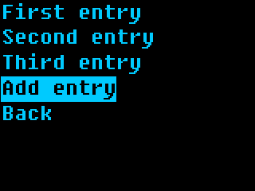
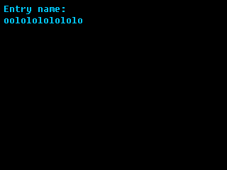
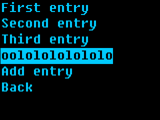

Once you have a little practice, it's so so easy to add features to your app!
Now let's add perhaps a final feature, list deletion, and talk about the different ways
in which you can add a feature.

`Click here <https://github.com/ZeroPhone/zpui-listolists/blob/e8ca0ec579ec8d285c728a61976eaf3605626da4/src/zpui_listolists/app.py>`_ to see how the app code looks at this point.

Mind your user!
===============

Let's add list deletion. A ``Menu`` lets you add an extra callback that's accessible
when user presses the right key, you simply need to add one more callback to the
main menu list entries, like this:

.. code-block:: python

    # in on_start:
    for index, list in enumerate(self.config["lists"]):
        mc.append([list.get("name", "List name missing!"), \
                   lambda x=index: self.list_menu(x), \
                   lambda x=index: self.list_options(x),])
    
    ...
    
    def list_options(self, list_index):
        mc = [
            ["Rename list", lambda: self.remove_list(list_index)],
            ["Remove list", lambda: self.edit_name(list_index)]
        ]
        Menu(mc, self.i, self.o, name=self.menu_name+f" list {list_index} options menu").activate()

Simple enough. What happens in ``remove_list``?

First, we ask whether the user actually wants to delete the list,
since we don't want misclicks. Then, we have two options:

- Actually delete the list
- Move a "deleted" list into a ``deleted`` config file entry

I personally go with the second option! Data loss sucks, and I think we need to give
the user an ability to reconsider deletion.

Here's how you can use a ``DialogBox`` to confirm deletion, and then backup the list after deleting:

.. code-block:: python

    def remove_list(self, list_index):
        db = DialogBox("yn", self.i, self.o, message="Remove entry?", name=self.menu_name+f"list {list_index} removal DialogBox")
        answer = db.activate()
        if not answer:
            return
        list = self.config["lists"].pop(list_index)
        self.config["deleted"].append({"type":"list", "contents":list})
        self.save_config()
        raise MenuExitException

The ``raise MenuExitException`` part lets us exit the parent menu immediately, which is good UX.
Without it, the user would get back to the same ["Rename list", "Remove list"] menu,
generated for an entry that no longer exists - which is subpar. Of course, remember to import
``MenuExitException`` (as well as ``DialogBox``) from ``zpui_libs.ui`` at the very top!

Noticed the ``"deleted"`` item is a dictionary, and there's a ``"type"``?
That's because we can also add entry deletion - let's add that! For a start,
here's a right click menu for entries:

.. code-block:: python

    # in list_menu:
    for entry_index, entry in enumerate(list.get("entries", [])):
        mc.append([entry,
                   lambda x=entry_index: self.edit_entry(list_index, x),
                   lambda x=entry_index: self.entry_menu(list_index, x),
        ])
    
    ...
    
    def entry_menu(self, list_index, entry_index):
        mc = [
            ["Rename entry", lambda: self.edit_entry(list_index, entry_index)],
            ["Remove entry", lambda: self.remove_entry(list_index, entry_index)],
        ]
        Menu(mc, self.i, self.o, name=self.menu_name+f" entry {list_index} {entry_index} options menu").activate()

Then, basically same entry removal code, copy-pasted:

.. code-block:: python

    def remove_entry(self, list_index, entry_index):
        db = DialogBox("yn", self.i, self.o, message="Remove entry?", name=self.menu_name+f"entry {list_index} {entry_index} removal DialogBox")
        answer = db.activate()
        if not answer:
            return
        entry = self.config["lists"][list_index]["entries"].pop(entry_index)
        self.config["deleted"].append({"type":"entry", "list_index":list_index, "contents":entry})
        self.save_config()
        raise MenuExitException

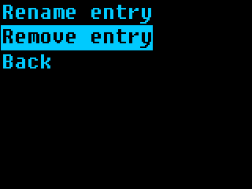
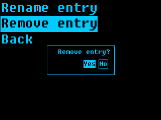

I'd walk you through viewing menu entries, but I think this tutorial will get too verbose.
By now, you already have all the building blocks, plus a good few ease-of-use extras!

`Click here <https://github.com/ZeroPhone/zpui-listolists/blob/551bf1e1a8277004e86cf5df261933dddc9c781b/src/zpui_listolists/app.py>`_ to see how the app code looks after all the work we've done.

---------------------------

As an aside - while the screenshots come from a 320x240 emulator screen,
the app will works on 128x64 screens without any changes needed, too!

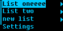

You can find the resulting app code `here`_,
but you might've noticed you don't need to install it - the app is now available in ZPUI, stock.
By the time you visit its code in the ZPUI repo, you could very well find it to have gained features!

.. _here: https://github.com/ZeroPhone/zpui_listolists

Hope this tutorial has been useful, and, let me know if anything has been unclear.
